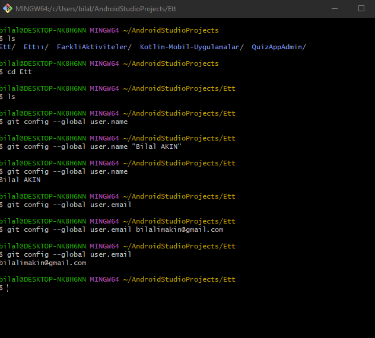
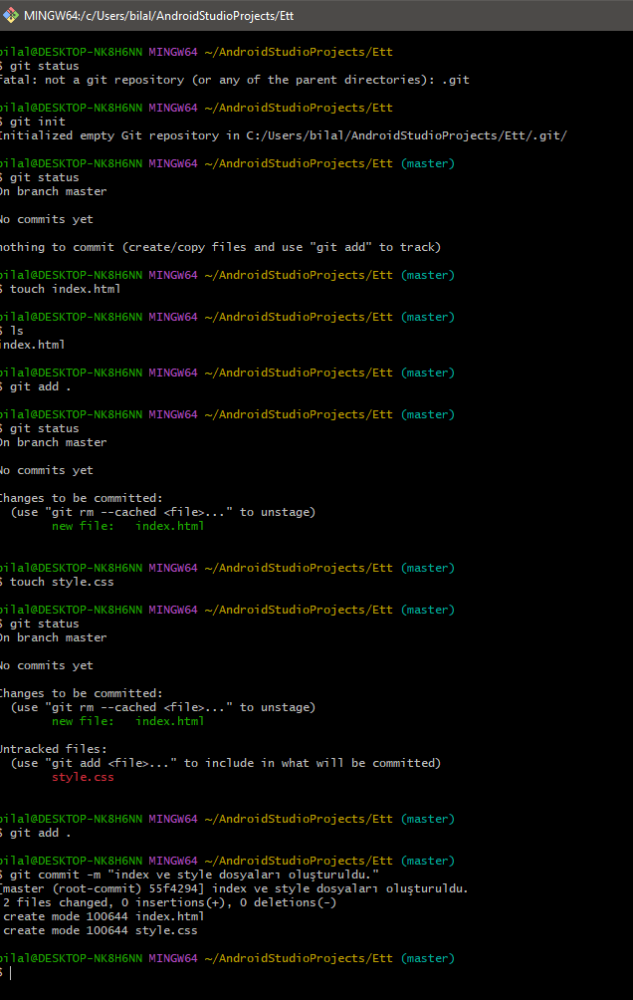

# Git-ve-GitHub-Komutlari

Versiyon Kontrolleri: Git ve GitHub Notları

# Git ve GitHub Kullanımı - Komutlar

## Terminal Kulanımı

**mkdir Ett :** Klasör oluşturur

**ls :** Bulunduğum dizindeki dosyaları listeler.

**cd (klasörAdi) :** Belirtilen Klasöre girer.

**cd .. :** Bir üst dizine gider.

**git config --global user.name :** Ad.Soyad Oluşturulmuş mu ? Kontrol eder.

**git config --global user.name "(Adınız ve Soyadınız)" :** Adınız ve Soyadınızı yazdığınızda Tanımlar.

**git config --global user.email :** Emailiniz Oluşturulmuş mu ? Kontrol eder.

**git config --global user.email "(mailim@gmail.com)" :** Emailinizi yazdığınızda Tanımlar.

**_git config --global --unset-all user.name :_** Kayıtlı Kullanıcıları siler.

**_git config --global --unset-all user.email :_** Kayıtlı Emailleri siler.

## Git Bash Temellleri

**git status :** Güncel Durumu Gösterir. Git yüklü mü ? Yapılan değişiklikleri gösterir.

**git init :** git'i başlatma veya Oluşturma.

**touch (dosyaAdi.uzantısı) :** Dosya oluşturur.

**rm (dosyaAdi.uzantısı) :** Dosyayı siler.

**git add . :** Oluşturduğunuz Dosyaları Hazırlar.

**git commit -m " Dosyamı Commitle" :** Yapılan Değişikliler Commitler. buna kaydetme diyebiliriz.

**_git rm -rf .git :_** .git dosyasını siler.

**git log :** Eklenen Commitleri gösterir.

**git commit -a :** Değişiklikleri add ve commit ayrı ayrı yapmak yerine değişiklikleri Ekler ve Commitler.(Önerilmez.)

**touch .gitignore :** Kaydedilmesini istemediğimiz dosyaları belirtmek için kullanıyoruz. .gitignore dosyasının içine style.css yazarsak artık o dosya kaydedilmez.

**git branch :** Mevcut Branchları Listeler.

**git branch (Yeni branch adı) :** Yeni branch oluşturur.

**git switch (branch adı) :** Başka branch geçişini sağlar.

**git merge (birleştirilmesini istenilen branch) :** iki branch' ı birleştirir.

**git restore (dosya adi):** Yapılan Son değişikliği geri al.

**git stash :** Yapılan değişikleri saklar. kaydetmez.

**git stash pop :** Saklanan en son Değişikliği geri alır.

**git stash list:** Saklanan verilerin hepsini geri alır.

**git stash apply :** Saklanan veriyi teker teker geri alır.

**git stash clear:** Saklanan veriyi siler.

**git checkout (Hash Kodu):** Daha önce atılan Commiti geri getirmek için kullanılır.

**git reset (Hash Kodu) :** Commitin açıklamasını siler. Sadece commiti siler yapılan değişiklere dokunmaz.

**git reset --hard (hash Kodu) :** Commit ve İçeriği Siler.

**git diff :** Güncel Tüm Değişiklikleri gösterir

**git diff (HAsh KOdu) :** belirtilen Commitin değişikliklerini gösterir.

**git rebase (branch adı):** belirtien  branchtaki commitleri ve kendi branchtaki commitleri hizalar.

## GitHub

git remote add origin (GİTHUP - URL)
git push -u origin master

